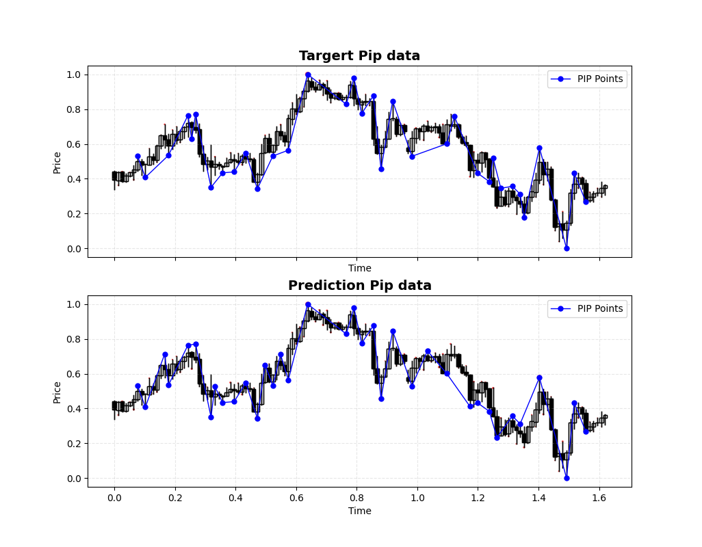
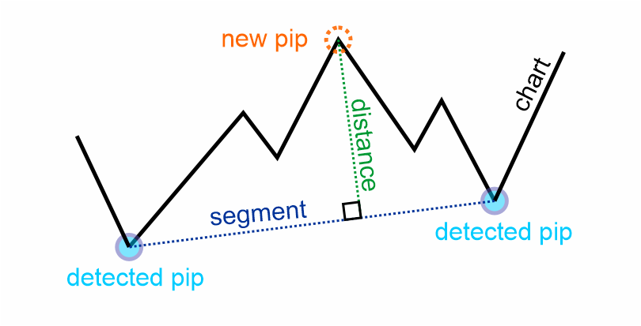

# 📊 Perceptually Important Point Detection in Financial Markets Using Transformers

This project aims to identify Perceptually Important Points (PIP) in financial charts, such as stock market prices, using a Transformer-based deep learning model. The workflow integrates key components to detect and interpret PIP points efficiently.



##  📄 Project Description

In this project, we aim to predict key information about pip points in financial market charts by analyzing OHLC (Open, High, Low, Close) data. The main goal is to estimate the distance of a pip point from its segment, which is a crucial metric for understanding price movement and market behavior. This distance can be used to derive a "perceptually important point" score, indicating the significance of the pip point in terms of its relevance to market trends. To aid in better understanding, we have included a visual representation showing how the perceptual importance score is calculated and applied to the data.



## 🛠️ Project Structure
- **Data Generation & Preprocessing 📊**

    We begin by generating pip data from OHLC market chart data, followed by preprocessing to clean, normalize, and format the data for the model. This ensures the data is ready for efficient model training. [Read more](docs/data-preprocessing.md)

- **Model Creation 🤖**

    The model uses transformer architecture to capture relationships in the OHLC data and predict the distance of pip points from segments. This approach leverages self-attention to understand complex dependencies in the data. [Read more](docs/model-architecture.md)

- **Training Process 🏋️**

    The model is trained using a custom configuration, including optimized hyperparameters and loss functions. Regular validation ensures accuracy, with the goal of effectively predicting pip point distances on new data. [Read more](docs/train-config.md)

## 🧩 Installation

1. Clone the repository:
```bash
git clone https://github.com/mehranESB/pip-predict-transformer.git
cd pip-predict-transformer
```

2. Install the project using `setup.py`:
```bash
pip install .
```

## 📚 Usage Guide

**1️⃣ Train the Model**

To train the model with your custom configuration:
```python
from percepformer import config, Trainer

# Modify configuration parameters as needed
config["train"]["batch_size"] = 64  
config["train"]["checkpoint_dir"] = "./DATA/checkpoints/train_7"
config["optimizer"]["parameters"]["lr"] = 0.001 
config["model"]["parameters"]["act_fun"] = "gelu"
config["model"]["parameters"]["d_model"] = 64
config["model"]["parameters"]["dropout"] = 0.05
config["data"]["pkl_pathes"] = [
    "./DATA/pip/EURUSD-1h.pkl",  
    "./DATA/pip/EURUSD-30m.pkl",  
]

# Initialize and start training
trainer = Trainer(config)  
trainer.train()
```

**2️⃣ Load a Checkpoint and Run Inference**

Once training is complete, you can load a trained model checkpoint and use it for inference on new OHLC data:
```python
from percepformer import Detector  
from pathlib import Path

# Define the path to the trained model checkpoint
checkpoint_path = Path("./DATA/best_checkpoints/medium/medium_1M.pth")

# Initialize the Detector with the given checkpoint
# This will load the model and prepare it for inference
detector = Detector(checkpoint_path)

# Run inference on your input dataframe (df_sample should be preprocessed OHLC data)
df_results = detector(df_sample)
```

📁 For more information and full examples, check the `example/` folder.

## 🧠 Available Models

We provide three pretrained models of varying sizes and capacities. Each model has been trained on pip point distance prediction using OHLC data, and evaluated with validation loss as a performance metric:

| Model  | Parameters | Validation Loss | Checkpoint |
|--------|------------|------------------|------------|
| **Small**  | ~336K      | 5.6 × 10⁻²       | [Download](https://drive.google.com/uc?export=download&id=1FGso_V19ZxWDbNFHCxxV3NrZh4auDJ30) | 
| **Medium** | ~1M        | 4.5 × 10⁻²       | [Download](https://drive.google.com/uc?export=download&id=1fPUzB8B0XuuDAS21ty4OSsOWDvzuDK_n) | 
| **Large**  | ~2.7M      | 3.4 × 10⁻²       | [Download](https://drive.google.com/uc?export=download&id=1v4SHS28EhBM3-L_HhHzmFpGbB9Sw1Bte) | 

## 🤝 Contributing
Contributions are welcome and appreciated!

Feel free to fork the repository, submit pull requests, or open issues for bugs, feature suggestions, or improvements.

## 📄 License
This project is licensed under the MIT License.
See the `LICENSE.txt` file for details.