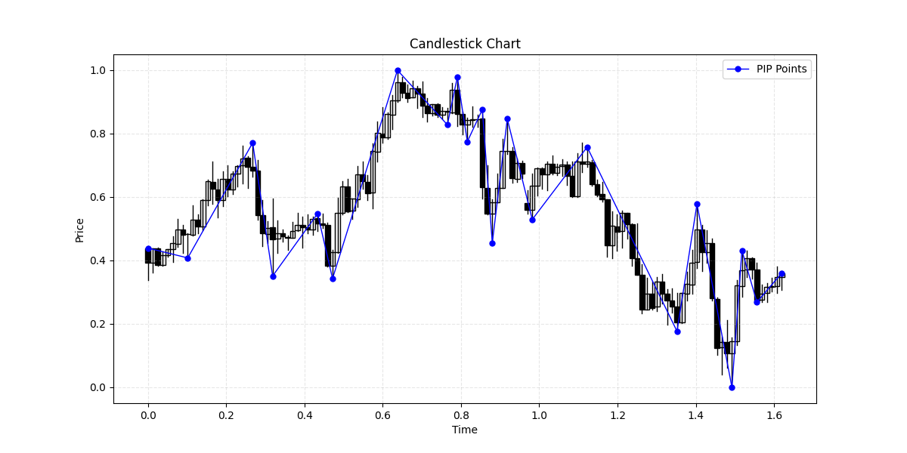
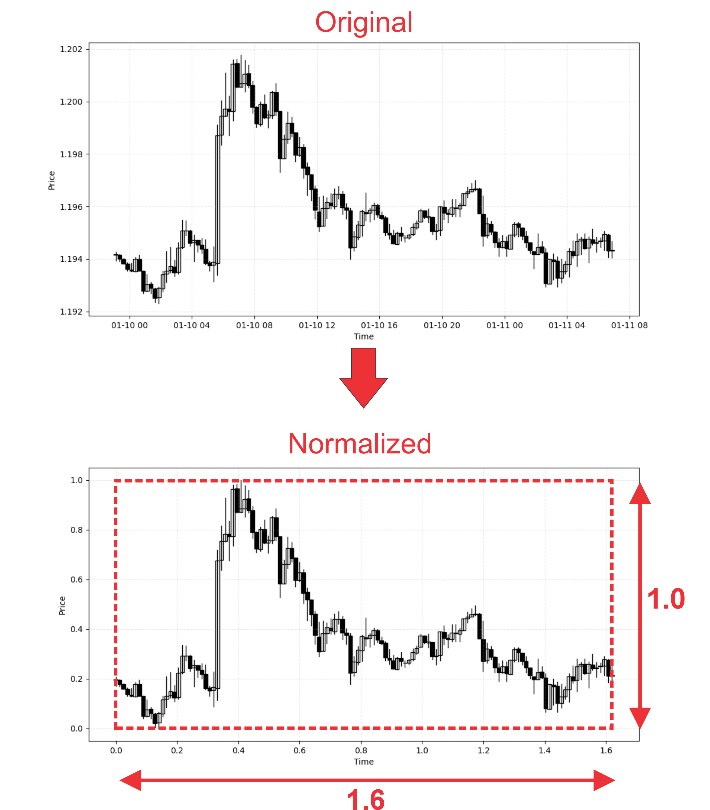
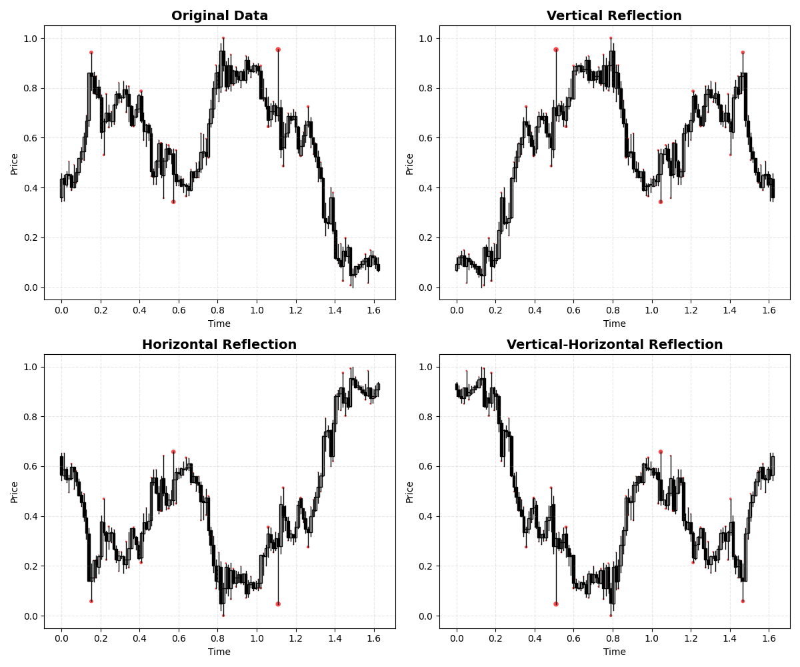
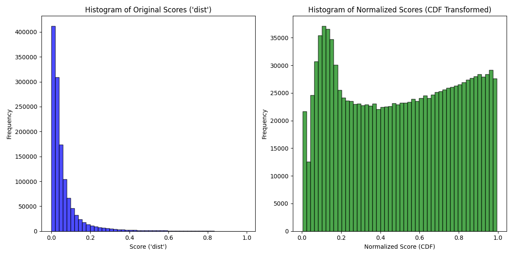

# Data Preprocessing

This document explains how to preprocess raw financial data for training the model. The preprocessing involves normalizing data to match a trader's perspective, ensuring compatibility with the PIP detection process. Below are the detailed steps.

## 📍 PIP Point Generation with `pipdet`

In this project, we use the [`pipdet`](https://github.com/mehranESB/chart-pip-detector.git) library to extract Perceptually Important Points (PIPs) from market chart data. This process creates `.pkl` files that include all the necessary information required for training the model.

For our training process, we focus on three key features for each detected pip point:

- `dist`: The distance of the pip point from its associated segment. This is the main value our model learns to predict.

- `hilo`: A binary flag indicating whether the pip point is the high (1.0) or low (0.0) of the corresponding candle.

- `iter`: The iteration step in which the point was detected as a pip — this can help analyze the detection process over time.

You can generate pip data using code example as below:
```python
from pipdet.pipgen import generate_pip
from pathlib import Path

# Path to the CSV file containing the market OHLCV data
csv_path = Path("./DATA/csv/EURUSD-1h.csv")

# Path where the generated PIP data will be saved (in .pkl format)
save_path = Path("./DATA/pip/EURUSD-1h.pkl")
save_path.parent.mkdir(parents=True, exist_ok=True)

# Generate the PIP points and distances
generate_pip(csv_path,
    pip_info_to_save=["dist", "hilo", "iter"], # Choose which PIP info to save for each point
    seq_len=128, # Sequence length of each OHLC segment window
    inc_index=20, # Step size to move forward in the OHLC data for next sample (how far to slide the window for generating the next sample)
    dist_method="perpendicular", # Method used to calculate distance from a segment (default is 'perpendicular')
    save_path=save_path,
)
```

The figure below shows a sample result of pip point detection using `pipdet`. In this example, pip points with a `dist` value less than 0.1 have been filtered out, leaving only the more perceptually significant ones.



## 📐 Data Normalization

To make the data visually intuitive and consistent, it is normalized along both the **x-axis (time)** and **y-axis (price)**. This step ensures the chart segments align with a trader’s eye view — maintaining a **fixed width and height** so that perceptual importance is not distorted by scale or volatility.

> ✅ **Note:**  
> When using the `pipdet` dataset or generating training data through our pipeline, normalization is **automatically applied**.  
> Additionally, the **inference pipeline includes normalization internally**, so there's **no need to normalize data manually** during prediction.

However, for better understanding of the process, we’ve included an example snippet below that demonstrates how normalization works, along with a visual result of the transformation.
```python
from chartDL.utils import csv as csv_utils
from pipdet.utils import tight_box_normalize_df

# Import source DataFrame and get a sample from source
csv_source_path = Path("./DATA/csv/EURUSD-15m.csv")
df_source = csv_utils.import_ohlcv_from_csv(
    csv_source_path, header=True, datetime_format="%Y-%m-%d %H:%M:%S"
)
df_sample = df_source.iloc[:128]

# Normalize the sample data 
normalized_data = tight_box_normalize_df(df_sample, width=1.6, height=1.0)
```

The figure below shows how a segment is transformed after normalization preserving its perceptual structure while aligning it to a consistent coordinate space:




## 🔁 Data Augmentation: Mirror Reflection

To enhance the dataset and improve generalization during training, we apply **data augmentation** using the **mirror reflection** technique. This strategy helps the model learn from more diverse chart patterns by synthetically generating variations of the original data.

The **mirror reflection** method reflects market data segments along one or both axes. This is applied during the training pipeline and has the effect of multiplying the variety of data patterns the model sees. The possible reflection modes are:

- **Horizontal Reflection:** Flips the data along the vertical axis.

- **Vertical Reflection:** Flips the data along the horizontal axis.

- **Vertical-Horizontal Reflection:** Applies both reflections simultaneously.

- **Random Mode:** Randomly applies one of the above (or no reflection) to each data sample.

> ✅ When using the **random mode**, each sample has 4 possible variations (original, horizontal, vertical, both), effectively **increasing the dataset size by 4x**. This randomness makes the model more robust and better at generalizing to unseen patterns.

Here's a simple example of applying the mirror_reflect transformation:
```python
from percepformer.utils.transform import mirror_reflect
from pipdet.dataset import PipDataset
from pathlib import Path

# Path to the preprocessed PIP dataset (in .pkl format)
pkl_path = Path("./DATA/pip/EURUSD-1h.pkl")

# Load the dataset and retrieve a sample at index 100
ds = PipDataset(pkl_path)
df_sample = ds[100]  # This is a single (normalized) OHLC segment with pip info

# Apply mirror reflection transformation
# mode="random" randomly chooses one of the four modes: none, horizontal, vertical, or both
mirror_reflected_sample = mirror_reflect(df_sample, mode="random")
```

The figure below shows how one market segment looks under each transformation.



## 🎯 Transforming Target `dist` Feature to `udist` for Learning

The raw dist values in our dataset are highly **imbalanced** — most are clustered close to zero. This creates difficulties when training regression models using common loss functions like **Mean Squared Error (MSE)**, which assume a more balanced distribution of targets.

To overcome this, we transform the `dist` values into a new feature called `udist` (uniform distance) using a statistical method. This transformation helps the model learn more effectively by making the target distribution more uniform.

### 🔄 Transformation Process

- **1. Fit a Generalized Extreme Value (GEV) Distribution:**

    The distribution of the dist values is modeled using a **GEV distribution**, which is well-suited for data with heavy tails (like extreme pip points).

- **2. Apply the Cumulative Distribution Function (CDF):**

    After fitting the GEV, we use its CDF to map dist values to a new space — the result is a **uniform distribution between 0 and 1**, which is easier for the model to learn from.

- **3. Invert After Training:**

    Once the model has been trained and produces predictions in the [0, 1] range, we use the **inverse CDF of the fitted GEV** to map predictions back to the original `dist` scale. This ensures that outputs remain meaningful and interpretable.

### ⚙️ Setting Up GEV Parameters for Training

Before training begins, you need to compute the GEV distribution parameters from your training dataset like example below. The resulting parameters should be added to your training `config` under the `data transformation` section. This enables automatic application of the `dist → udist` transformation during training, and `udist → dist` inversion after prediction.
```python
from percepformer.utils.dataset import dist_GEV_param, 
from pathlib import Path

# List of paths to your .pkl files
pkl_files = [
    Path("./DATA/pip/EURUSD-15m.pkl"),
    Path("./DATA/pip/EURUSD-30m.pkl"),
    Path("./DATA/pip/EURUSD-1h.pkl"),
]

# Fit the GEV distribution using the provided function
dists, mu, sigma, xi = dist_GEV_param(pkl_files, sample_num=5000)
```
The figure below illustrates the transformation of the target `dist` values. On the left, you see the original distribution of dist — heavily skewed with many values near zero. On the right, the transformed values `udist`(CDF(`dist`)), derived from applying the **GEV cumulative distribution function**, are spread uniformly between 0 and 1.


