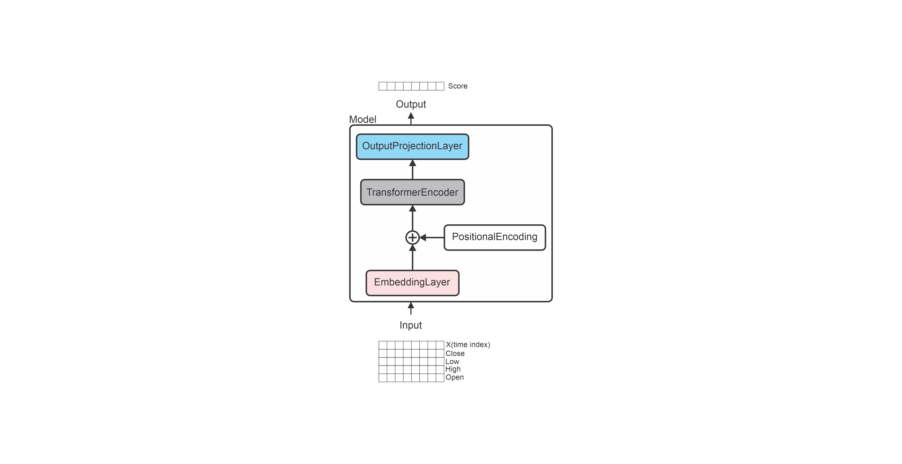
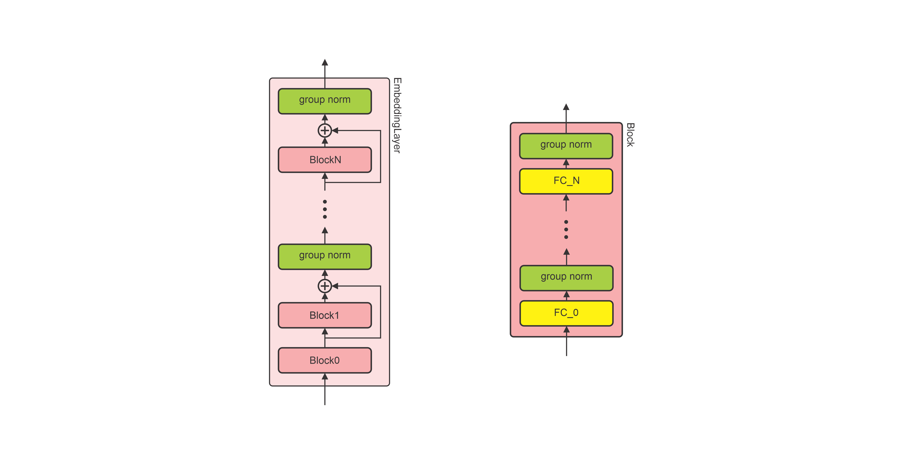
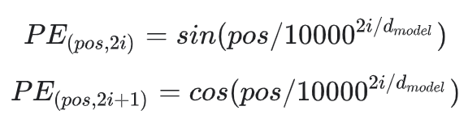
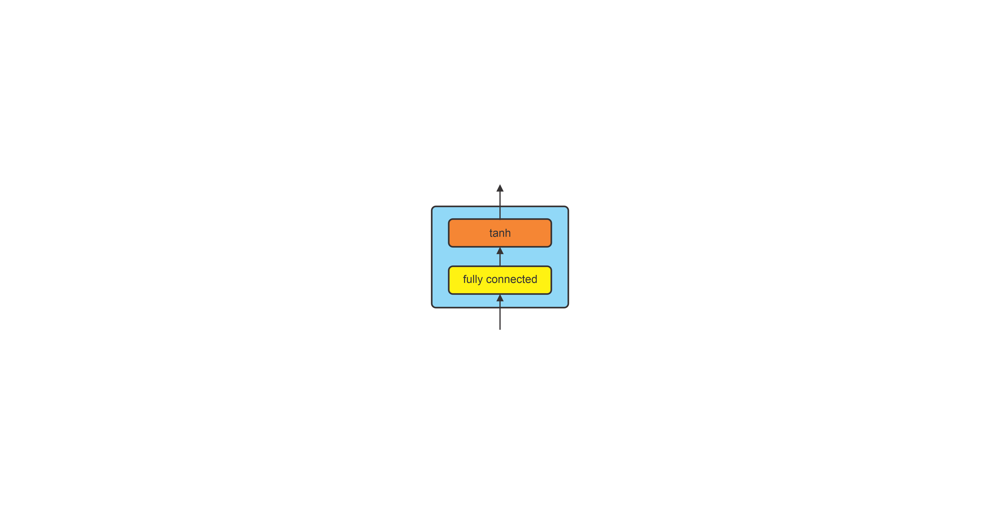

# Model Architecture

This document provides a detailed explanation of the model architecture utilized for Perceptually Important Points (PIP) detection. The architecture is built to process time-series OHLC data and predict PIP points along with their associated scores. Below is a breakdown of the architecture and its key components, complemented by schematic figures for better understanding.

## Overview of the Model

The model comprises several interconnected layers designed to process and analyze the input data efficiently:

1. **EmbeddingLayer:** Converts raw input into a high-dimensional representation using block and residual structures.

2. **PositionalEncoding:** Adds positional information to the embedded data to retain sequence order.

3. **TransformerEncoder:** Extracts meaningful relationships between elements in the sequence using attention mechanisms.

4. **OutputProjectionLayer:** Generates predictions for high/low representation and transformed distance scores as single value for each bar. (Score =  (if high_i) * dist_i - (if low_i) * dist_i).

Below is a schematic representation of the entire model architecture. For more information about the input data, note that "X" in the input represents just the normalized time index for each data point in the sequence.

## 1. Embedding Input with `EmbeddingLayer`

The `EmbeddingLayer` is the first component of the model, responsible for transforming the raw OHLC data into a format suitable for Transformer-based processing. It includes a residual block structure to:

- Embed the input data into a higher-dimensional space.

- Preserve raw data information through skip connections.

- Normalize and scale data to align with subsequent positional encoding.

The schematic figure below illustrates the block structure and residual connections of the EmbeddingLayer:

## 2. Sinusoidal Positional Encoding with `PositionalEncoding`

To incorporate the order of the sequence, the model employs Sinusoidal Positional Encoding. This method:

- Adds a set of sine and cosine functions of varying frequencies to the embedded input.

- Ensures that positional information is unique and differentiable for each time step.

- Helps the Transformer layer understand temporal dynamics in the data.

Equation for Positional Encoding:

## 3. Transformer Encoder with `TransformerEncoder`

The Transformer Encoder forms the core of the model, leveraging self-attention mechanisms to:

- Identify dependencies and relationships between elements in the sequence.

- Assign importance weights to different parts of the sequence using attention scores.

- Aggregate information into a meaningful representation for downstream tasks.

**Schematic Representation:**

## 4. Output Projection Layer with `OutputProjectionLayer`

The Output Projection Layer is the final stage of the model, producing single output for each elements in the sequence. After all transformations, a tanh activation is applied to the outputs, ensuring they lie between -1 and 1. This layer applies a fully connected network to map the Transformer outputs to the desired prediction space.

Schematic Representation:

By combining these components, the model effectively captures the geometric and temporal dynamics of OHLC data, enabling accurate PIP detection and scoring.